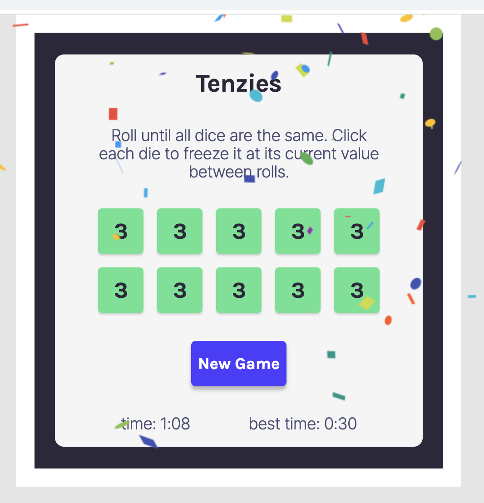

# Tenzies

A React game based on [this Figma design](https://www.figma.com/file/FqsxRUhAaXM4ezddQK0CdR/Tenzies?node-id=0%3A1). This was my fourth project for the [Scrimba React course](https://scrimba.com/learn/learnreact/), using useEffect, useState, and useCallback hooks, child components with props whose state is maintained by the parent, conditional rendering, event listeners, and more.

The game is hosted on Netlify -- click the screenshot below to play. It's fun!

In addition to the project steps dictated by the tutorial, I added a feature which tracks the elapsed time of each game and saves the fastest win time in LocalStorage.

This project was bootstrapped with [Create React App](https://github.com/facebook/create-react-app).

